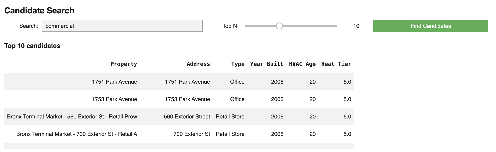
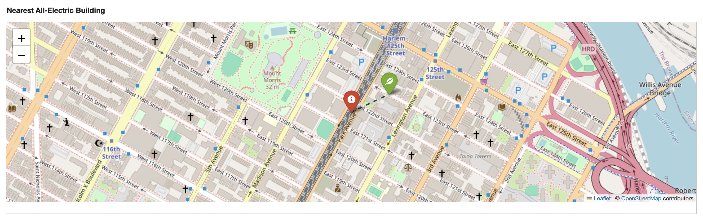
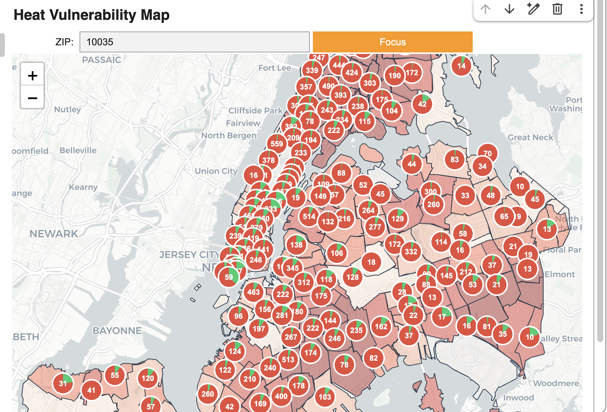
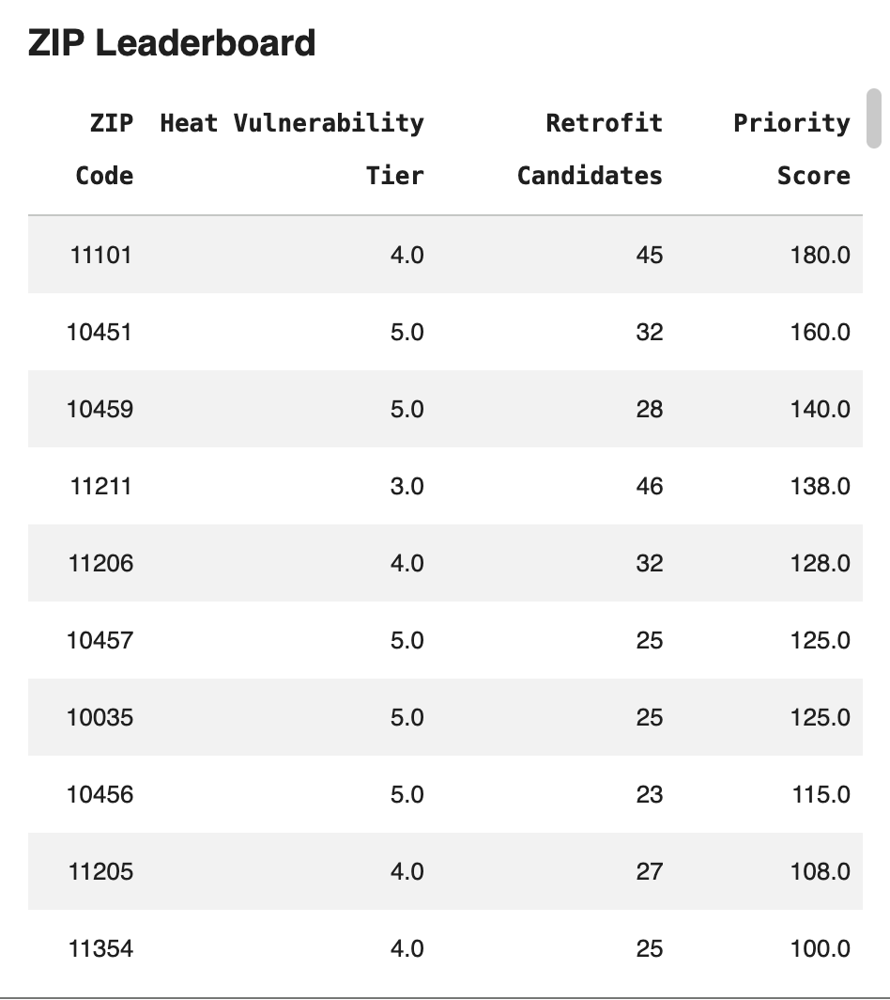
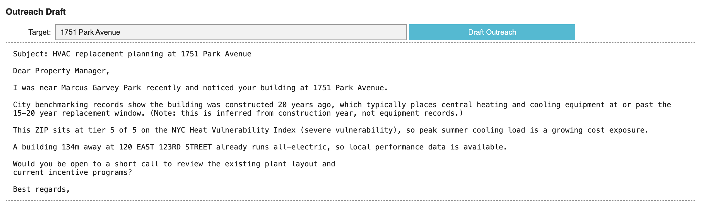
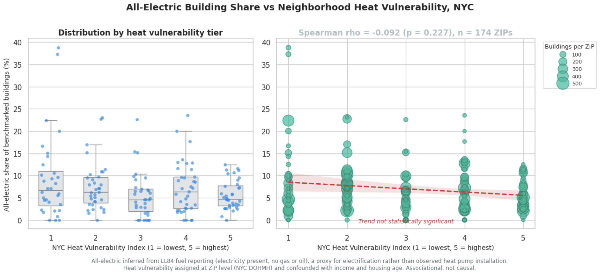

# NYC Building Electrification Screening

Screens NYC building energy benchmarking data to rank buildings by heat pump
retrofit potential, combining equipment-age inference with neighborhood heat
vulnerability, and drafts owner outreach for the resulting shortlist.

## What it does

Municipal benchmarking disclosure tells you how much energy a building uses and
what fuels it burns, but not which buildings are worth approaching about
electrification. This pipeline turns that raw disclosure into a ranked target
list.

At current scale it processes **30,938 building records across 271 ZIP codes**,
joins neighborhood heat vulnerability at a **99.3% match rate**, identifies
**1,993 already all-electric buildings**, and surfaces **1,459 retrofit
candidates** ranked by heat vulnerability tier and inferred equipment age.

## Data sources

| Layer | Source | Notes |
|---|---|---|
| Buildings | NYC Open Data `5zyy-y8am` | LL84 energy benchmarking disclosure |
| Heat vulnerability | NYC Open Data `4mhf-duep` | NYC DOHMH Heat Vulnerability Index, ordinal tiers 1-5, assigned by ZIP |
| Geometry | NYC ZCTA polygons (GeoJSON) | For choropleth rendering |

## Pipeline

1. **Ingest** LL84 disclosure and the heat vulnerability index over HTTP
2. **Resolve columns** dynamically, since the LL84 schema shifts between releases
3. **Clean** — coerce numerics, drop ungeocoded rows, deduplicate by address
4. **Classify fuel mix** — flag buildings reporting electricity and no gas or oil
5. **Join thermal** — merge heat vulnerability by ZIP, leaving unmatched rows null
6. **Filter candidates** — buildings built 2006-2011 that are not already all-electric
7. **Rank** — order by heat vulnerability tier, then inferred equipment age
8. **Proximity match** — find the nearest all-electric building in projected coordinates
9. **Draft outreach** — fill a template with address, equipment age, heat tier, and nearest comparable
10. **Visualize** — interactive candidate table, proximity map, and citywide choropleth

## Output

**Candidate search** — ranked retrofit targets filtered by property type



**Proximity match** — target building and nearest all-electric comparable, measured in projected coordinates



**Heat vulnerability map** — ZIP-level tiers with per-ZIP candidate counts and electrification share



**ZIP leaderboard** — neighborhoods ranked by candidate volume weighted by heat tier



**Outreach draft** — template-filled letter using address, inferred equipment age, heat tier, and nearest comparable



## Method limits

These are real constraints, not boilerplate. Read them before citing any number
from this repo.

- **All-electric is a proxy, not an observation.** LL84 reports fuel consumption,
  not equipment type. A building reporting electricity with no gas or oil is
  inferred to be all-electric. It may use resistance heating rather than a heat
  pump.
- **Blank does not mean zero, but is treated as zero.** LL84 records unused fuels
  as "Not Available" rather than 0. The classifier treats a blank fossil column as
  absent fuel. Under a strict reading that requires an explicit zero, the count is
  0, since LL84 never writes one. The 1,993 figure is therefore an upper bound.
- **Equipment age is inferred from construction year.** Buildings that already
  replaced HVAC are indistinguishable from those that have not.
- **Heat vulnerability is ZIP-level.** Every building in a ZIP shares one tier, and
  that tier correlates with income and housing age.
- **No trained model.** Targeting is deterministic rule-based filtering and ordinal
  ranking. Outreach is template substitution. There is no ML component.

## Validation result

Testing all-electric share against heat vulnerability across 174 ZIP codes
(30,698 buildings):

| Statistic | Value | p |
|---|---|---|
| Spearman rho | −0.092 | 0.227 |
| Pearson r | −0.169 | 0.026 |
| Pearson r (building-weighted) | −0.214 | — |



**No significant monotonic relationship.** Spearman is the appropriate statistic
here because the heat index is ordinal, and it does not clear significance. The
two tests disagree because the pattern is not monotonic — tier means run 9.3,
7.5, 5.5, 7.2, 5.7, rising again at tier 4.

The direction is nonetheless consistent with an equity gap: electrification is
somewhat lower in more heat-vulnerable neighborhoods, which are also lower income
with older housing stock. That confound is not controlled for here, so the result
is descriptive only.

## Repo structure

```
├── README.md
├── src/
│   ├── building_decarbonization_system.py   # ingestion, screening, ranking, UI
│   └── validation_analysis.py               # ZIP-level statistical validation
├── images/
│   ├── Candidate_Search.png
│   ├── All_Electric_Building_Proximity.png
│   ├── Heat_Vulnerability_Map.png
│   ├── ZIP_Leaderboard.png
│   ├── Outreach_Draft.png
│   └── Validation_Result.png
└── requirements.txt
```

## Running it

```bash
pip install -r requirements.txt
```

Run `building_decarbonization_system.py` first, then `validation_analysis.py` in
the same session — the validation script reuses the loaded GeoDataFrame and the
resolved column names.

If the NYC Open Data API is unreachable the script falls back to clearly labelled
demo data, prints a warning block, and renders a red banner in the UI. Demo
output is not real and should not be cited.

## Development note

An earlier version of this pipeline contained a fallback that randomly flagged
25% of buildings as electrified whenever real detections fell below a threshold.
Real detections were zero, because the classifier tested `fuel == 0` against
values that pandas had coerced to `NaN`, so every genuinely all-electric building
failed the test. The fallback masked the bug, and the validation correlation was
measuring random noise. Both issues are fixed; the fallback is removed and the
classifier is NaN-aware.
